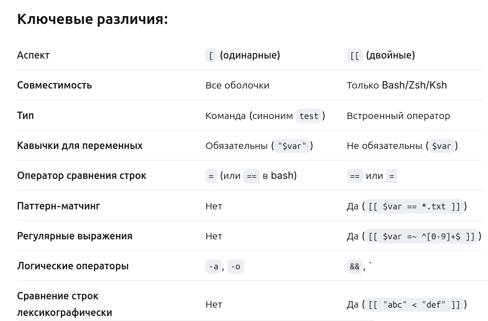

**Вопрос 1**

Узнать, где мы находимся: `pwd`

Перейти в домашнюю директорию: `cd ~` или `cd`

Создать структуру папок projects/website/logs одной командой: `mkdir -p projects/website/logs`

Проверить, что структура создана: 
```
find projects/website/logs
ls -R projects
ls -la projects/website
find projects -type d | sort
```

**Вопрос 2**

«В директории /var/log нужно найти все файлы логов за последние 7 дней, которые больше 10MB. Составьте команду find с необходимыми опциями.»
    
    find /var/log -type f -name «*.log» -mtime -7 -size +10M

Разбор опций:
    
    find /var/log   # искать в директории /var/log
    -type f  # искать только файлы (не директории)
    -name "*.log"  # файлы с расширением .log (можно расширить или изменить шаблон)
    -mtime -7  # изменены менее 7 дней назад
    -size +10M  # размер больше 10 мегабайт
Дополнительно:
    
    -mtime +7    # изменены более 7 дней назад
    -atime +30   # не читались более 30 дней
    -mmin +120   # изменены более 120 минут назад (2+ часов)

**Вопрос 3**

«Создайте алиас ll, который показывает подробный список файлов включая скрытые. Как сделать так, чтобы этот алиас работал при каждом входе в систему?»

**Алиас** — это сокращенное имя или команда, которое вы создаете для более длинной или часто используемой команды в командной оболочке (bash, zsh, fish и т.д.)

Сначала создадим сам алиас в текущей сессии: `alias ll='ls -la'`

Теперь можно проверить его работу: `ll`

Чтобы алиас работал при каждом входе в систему, нужно добавить его в конфигурационный файл оболочки.
    
    echo "alias ll='ls -la'" >> ~/.bashrc

**Вопрос 4**

«Объясните концепцию stdin, stdout, stderr. Как перенаправить stderr в файл, а stdout вывести на экран? Как перенаправить убрать stderr из вывода команды?»

**stdin, stdout, stderr** — это три стандартных потока ввода-вывода, которые автоматически открываются для каждой программы в Unix-подобных системах (Linux, macOS) и в Windows. Они обеспечивают базовый механизм взаимодействия программы с внешним миром.

**Файловый дескриптор** (file descriptor, fd) — это неотрицательное целое число, которое операционная система использует для идентификации открытого файла или потока ввода-вывода в процессе.

1. **stdin** (Standard Input — стандартный вход)
```
    Назначение: Поток для чтения данных программой.
    Файловый дескриптор: 0.
    По умолчанию: Связан с клавиатурой
    Использование: cat < file.txt  # перенаправление файла в stdin
```

2. **stdout** (Standard Output — стандартный выход)
```
    Назначение: Поток для вывода обычных данных программы.
    Файловый дескриптор: 1.
    По умолчанию: Вывод на экран (терминал).
    Использование: echo "Hello"  # "Hello" выводится в stdout
```


3. **stderr** (Standard Error — стандартный поток ошибок)
```
    Назначение: Поток для вывода диагностических сообщений, ошибок, предупреждений.
    Файловый дескриптор: 2.
    По умолчанию: Также выводится на экран, но независимо от stdout.
    Важно: Позволяет отделить нормальный вывод от ошибок, чтобы их можно было обрабатывать раздельно.
```

Перенаправление только stderr в файл: `command 2> errors.log`

Перенаправление stdout и stderr в разные файлы: `command > output.log 2> errors.log`

Перенаправление stderr в stdout (2>&1): `command > combined.log 2>&1`

Убрать stderr из вывода команд: `command 2> /dev/null`

_Простой способ запомнить синтаксис:_
```
    1> или просто > — stdout
    2> — stderr
    &> — оба потока (stdout + stderr)
    /dev/null — "черная дыра" (данные исчезают)
    2>&1 — "перенаправить stderr туда же, куда сейчас идет stdout"
```

**Вопрос 5** - не сделан

Расскажите в общих чертах как устроена файловая система linix. Объясните разницу между абсолютным и относительным путем. Приведите примеры перехода из /home/user/documents в /var/www используя оба способа.

**Вопрос 6**

«Вопрос по git. У вас есть проект, в котором вы изменили файлы index.html, style.css и script.js.»

Добавьте в stage только index.html и style.cssgit: `add index.html style.css`

Проверьте статус репозитория :`git status` (index.html и style.css находятся в staged состоянии, script.js будет отображаться как измененный, но не staged)

Сделайте коммит с сообщением: `git commit -m «Upd index.html and style.css»`

Посмотрите историю коммитов в одну строку: `git log --oneline`
      

**Вопрос 7**

Вы создали новую ветку feature-login и сделали в ней 3 коммита. Как:

Проверьте статус репозитория `git checkout main`

Сделайте коммит с сообщением `git merge feature-login`

Посмотрите историю коммитов в одну строку `git branch -d feature-login`

**Вопрос 8**

У вас есть лог-файл access.log. Напишите команду, которая: Находит все строки, содержащие слово "ERROR", Подсчитывает их количество, Сохраняет результат в файл error_count.txt

`grep -c "ERROR" access.log > error_count.txt`

`grep` ищет и выводит строки в файле (или потоке данных), которые соответствуют заданному шаблону.

**Вопрос 9**

Объясните, что делает эта команда:

`cat app_users.txt | sort | uniq -c | sort -nr -k1 | head -10`

`cat app_users.txt` - вывод данных этого файла

`| sort` - сортирует файлы

`| uniq -c` - удаляет повторяющиеся подряд идущие строки и рядом выводим количество повторений каждой уникальной строки

`| sort -nr -k1` - (n) числовая сортировка, (r)обратный порядок, k1 - сортировка по первому столбцу 

`| head -10` - первые 10 строк результата

**Вопрос 10**
Напишите конвеер команд (pipeline), который: 
1. Выведет список всех файлов в текущей директории 
2. Оставит только строки, содержащие .log 
3. Отсортирует по имени 
4. Выведет первые 5 результатов
    
`ls | grep "\.log" | sort | head -5`

`|` — символ конвейера (pipe), передаёт вывод предыдущей команды на вход следующей

`grep "\.log"` — фильтрует строки, оставляя только те, которые содержат ".log". Обратный слэш \ нужен для экранирования точки, так как в регулярных выражениях точка означает "любой символ"

**Вопрос 11**

В чем разница между:
1. command > file.txt 
2. command >> file.txt 
3. command 2> error.txt 
4. command &> all.txt 
Приведите примеры использования каждого варианта.

Приведите примеры использования каждого варианта.
1. '>' перенаправление stdout (перезапись файла)
2. '>>' дописывает в конец файла 
3. 2> перезаписывает файл ошибками, если есть 
4. &> перенаправление stdout and stderr вместе (перезаписись файла)


Пример 1:
```
ls -la > file.txt   //перезапись
echo "Null" > file.txt //перезапись
```

Пример 2:
```
echo "$(date): today" >> file.txt     //Sat Dec  6 03:19:22 PM MSK 2025: today
who >> file.txt //Sat Dec  6 03:19:22 PM MSK 2025: today
```
Пример 3:
```
grep "pattern" nonexistent.txt 2> errors.log
// grep: nonexist.txt: No such file or directory

rm /root/file 2> permission_errors.txt
// rm: cannot remove '/root/file': Permission denied
```
Пример 4:
```
./script.sh &> output.log
// Все сообщения скрипта (и обычные, и ошибки) в output.log

make build &> build.log
// Весь вывод компиляции в один лог-файл
```

**Вопрос 12**

Объясните вывод команды `ls -l`:
```
-rw-r--r-- 1 alice alice 2048 Jan 15 10:30 config.txt
drwxr-xr-x 3 bob   root 4096 Jan 14 15:20 logs
```

[права] [ссылки] [владелец] [группа] [размер] [дата последнего изменения] [имя файла]

```
-rw-r--r--- права доступа:
- обычный файл
rw- права владельца r (read) and w(write) (could be also x, испольнение)
r-- права группы: чтение
r-- права остальных: чтение
1 кол-во жестких ссылок
alice - владелец файла, группа-владелец
2048 - размер файла в байтах
Jan 15 10:30 дата последнего редактирования
config.txt имя файла
```

```
drwxr-xr-x - права доступа:
d - директория
rwx - владелец
r-x - группа
r-x - остальные
3 - количество жестких ссылок
bob - владелец
root - группа-владелец
4096 размер в байтах
```
1. Первый символ: Тип файла

   — обычный файл (regular file)

   d директория (directory)

   l символическая ссылка (symbolic link)

   b блочное устройство (block device), например, диск

   c символьное устройство (character device), например, терминал

   p именованный канал (pipe)

   s сокет (socket)

2. Права доступа (9 символов):
    Разбиваются на 3 группы по 3 символа:
    владелец, группа, остальные 

    r (read) чтение (для файла) / просмотр содержимого (для директории)
    
    w (write) — запись (для файла) / создание/удаление файлов (для директории)
    
    x (execute) — выполнение (для файла) / вход в директорию
   

***Вопрос 13***

Вам нужно создать скрипт backup.sh, который:
    • Может исполнять только владелец 
    • Может читать группа и другие пользователи 
    • Никто кроме владельца не может изменять 
    • Выводит имя пользователя, который запустил скрипт

`nano backup.sh`

Установка необходимых прав доступа:
`chmod 744 backup.sh`
`-rwxr--r-- 1 owner group ... backup.sh`

4 - read, 2 - write, 1 - execute
`SCRIPT_OWNER=$(stat -c '%U' "$0")`

`CURRENT_USER=$(whoami)`

```angular2html
#!/bin/bash
if [ ! -x "$0" ]; then
    echo "ОШИБКА: Скрипт может выполнять только владелец!"
    exit 1
fi

echo "=== СКРИПТ BACKUP.SH ==="
echo "Запущено пользователем: $(whoami)"
```

$0 - специальная переменная, содержащая имя текущего скрипта

-x - оператор проверки файла в bash, который проверяет:
Есть ли у текущего пользователя право на выполнение (execute) этого файла

***Вопрос 14***

Как узнать:
    • К каким группам принадлежит текущий пользователь: `groups`
    • Какой UID у пользователя www-data: `id -u www-data` 
    • Кто является владельцем файла /etc/passwd: `ls -l /etc/passwd` 

***Вопрос 15***

Ваше приложение app.py зависло и не отвечает на запросы. Опишите последовательность действий:

• Как найти PID этого процесса? `ps aux | grep app.py`

• Как "сказать" процессу, чтобы он завершился? `kill Proccess_ID`

• Если не помогло и процесс не хочет завершаться, как принудительно убить его? `kill -KILL Proccess_ID`

***Вопрос 16***
Объясните вывод команды top:
load average: 2.50, 1.80, 1.20

***Load Average*** (средняя нагрузка) — это один из самых важных показателей в Unix-системах, показывающий количество процессов, ожидающих выполнения (в очереди на CPU, ожидающие дискового ввода/вывода и т.д.).
CPU = Central Processing Unit = Центральный процессор = "Мозг" компьютера.

Три числа представляют среднюю нагрузку за три периода времени:
1. 2.50 — средняя нагрузка за последние 1 минуту 
2. 1.80 — средняя нагрузка за последние 5 минут 
3. 1.20 — средняя нагрузка за последние 15 минут


***Вопрос 17***

Создайте сжатый архив всех .log файлов из директории /var/log/app и сохраните его как logs_backup.tar.gz. Затем выведите список файлов в архиве без распаковки.

Создание архива: `tar -czf logs_backup.tar.gz -C /var/log/app ./*.log`

    Создание архива:
        tar - утилита для работы с архивами
        -c - создать новый архив
        -z - сжать с помощью gzip
        -f - указать имя файла архива
        -C /var/log/app - сменить рабочую директорию на /var/log/app перед выполнением операции

        ./*.log - добавить все файлы с расширением .log из текущей директории

Просмотр файлов в архиве: `tar -tzf logs_backup.tar.gz`
    
    -t - вывести список файлов в архиве
    -z - указать, что архив сжат gzip
    -f - указать имя файла архива


***Вопрос 18***
Объясните вывод df -h:

```
Filesystem      Size  Used Avail Use% Mounted on
/dev/sda1        50G   45G    5G  90% /
/dev/sdb1       100G   20G   80G  20% /data
```

Вывод команды df -h показывает информацию о дисковых разделах (файловых системах).

Колонки:

    Filesystem - Имя устройства или файловой системы
    Size - Общий размер раздела
    Used - Использованное пространство
    Avail - Свободное пространство
    Use% - Процент использования
    Mounted on - Точка монтирования (где доступен раздел)


***Вопрос 19***
Напишите простой скрипт, который:
    • Принимает имя файла как аргумент 
    • Проверяет, существует ли файл 
    • Если существует, выводит "File exists", если нет - "File not found" 

```angular2html
#!/bin/sh

if [ $# -eq 0 ]; then
    echo "Ошибка: Укажите имя файла как аргумент"
    echo "Использование: $0 <имя_файла>"
    exit 1
fi

filename="$1"

if [ -e "$filename" ]; then
    echo "File exists"
else
    echo "File not found"
fi
```
`chmod +x simple.sh`

`./simple.sh file.txt`


***Вопрос 20***

Объясните разницу между одинарными и двойными квадратными скобками в bash:
    
    if [ -f file.txt ]
    if [[ -f file.txt ]]

[] - это команда test - команда для проверки условий

    test -f file.txt
    [ -f file.txt ]

[] работают везде, но вокруг переменных надо ставить кавычки (без них могут быть ошибки)

    if [ "$filename" = "test.txt" ]; then

[[]] - новый удобный способ писать условия, но работает только в bash (в sh не поддерживается)

    if [[ $filename = "test.txt" ]]; then



***Вопрос 21***

Напишите скрипт, который перебирает все .txt файлы в текущей директории и выводит размер каждого файла.

```angular2html
#!/bin/bash
for file in *.txt; do
    if [ -f "$file" ]; then
        size=$(stat -f%z "$file" 2>/dev/null || stat -c%s "$file" 2>/dev/null)
        echo "$file: $size байт"
    fi
done
```

`stat -f%z` - флаг для BSD-систем (macOS, FreeBSD)
`%z` - выводит размер файла в байтах

`stat -c%s` - флаг для GNU/Linux систем
`%s` - выводит размер файла в байтах

***Вопрос 22***

Вы работаете инженером в крупной компании. Вам пришло уведомление (алерт), что на одном из ваших хостов остановлен сервис nginx:
    
• Посмотрите статус сервиса

    sudo systemctl status nginx
• Запустите его, если он остановлен

    sudo systemctl start nginx
• Добавьте его в автозагрузку через systemctl 

    sudo systemctl enable nginx
• Перезапустите сервис 

    sudo systemctl restart nginx

***Вопрос 23***

Диск заполнен на 95%. Опишите последовательность команд для диагностики:

• Как найти самые большие директории? 

    du -sh * | sort -hr 
    # you can add "| head -10" to show the 10 biggest ones

• Как найти файлы больше 100MB?

    find . -type f -size +100M

***Вопрос 24***

Приложение не стартует. В логах ошибка "Permission denied". Придумайте как можно больше гипотез о причинах такого поведения.
1. отсутсвие прав на файлы/директории
2. запуск от неправильного пользователя
3. файлы read-only
4. проблема с портами (программа хочет один, но у нее нет на него прав / он занят)
5. нет свободного места на диске
6. программа уже запущена (файл заблочен копией программы)

***Вопрос 25***

В чем разница между жесткой (hardlink) и символической (symlink) ссылкой? Приведите примеры использования каждой. Что такое иноды (inode)?

***Инод*** (inode - index node) — это структура данных в файловой системе (например, ext4, XFS), которая хранит метаданные о файле и указатель на его данные, но не хранит его имя.
Что хранится в иноде:
Тип файла, Права доступа, Владелец и группа, Размер файла, Временные метки (время создания, изменения, доступа), Счетчик жестких ссылок , Указатели на блоки данных на диске, где хранится содержимое файла.

    ls -i file.txt  #7131839 file.txt номер - и есть инод

***Hardlink*** - как название файла, меняется файл - меняется hardlink. Этой записи присваивается тот же номер инода, что и у исходного файла

    ln file.txt link.txt

***Symlink*** - ярлык/указатель на другой файл (отдельный файл-ссылка)
меняется файл - symlink перестает работать (ведет в никуда). Разные номера инодов! У ссылки свой инод, и в ее правах доступа стоит буква l (link).
Создание "ярлыков" к часто используемым файлам или каталогам в удобном месте.

    ln -s file.txt link.txt

